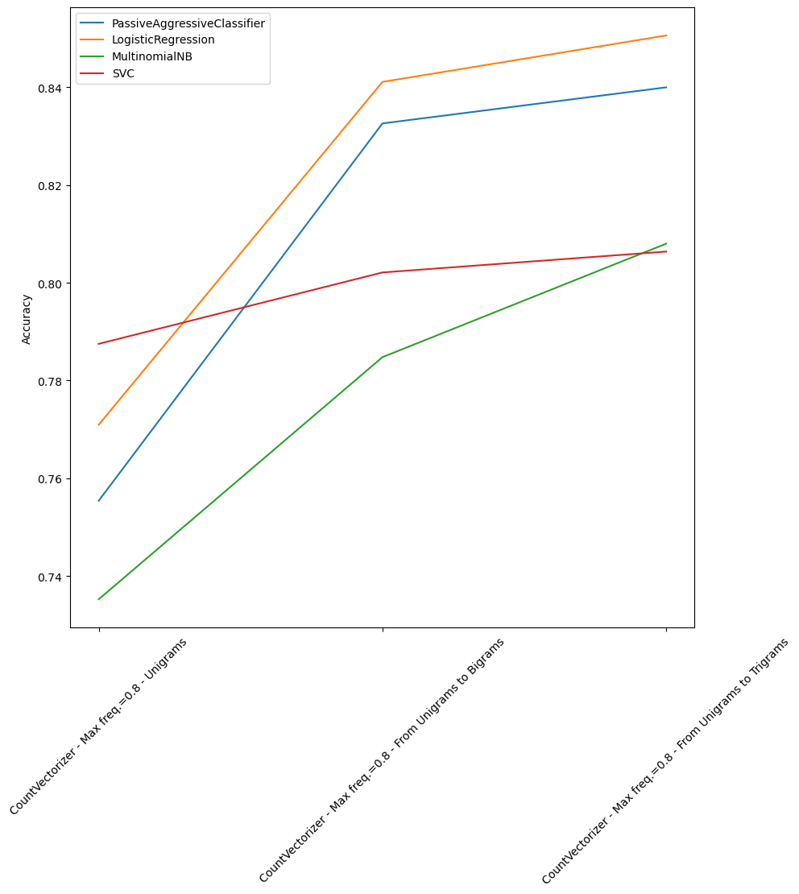
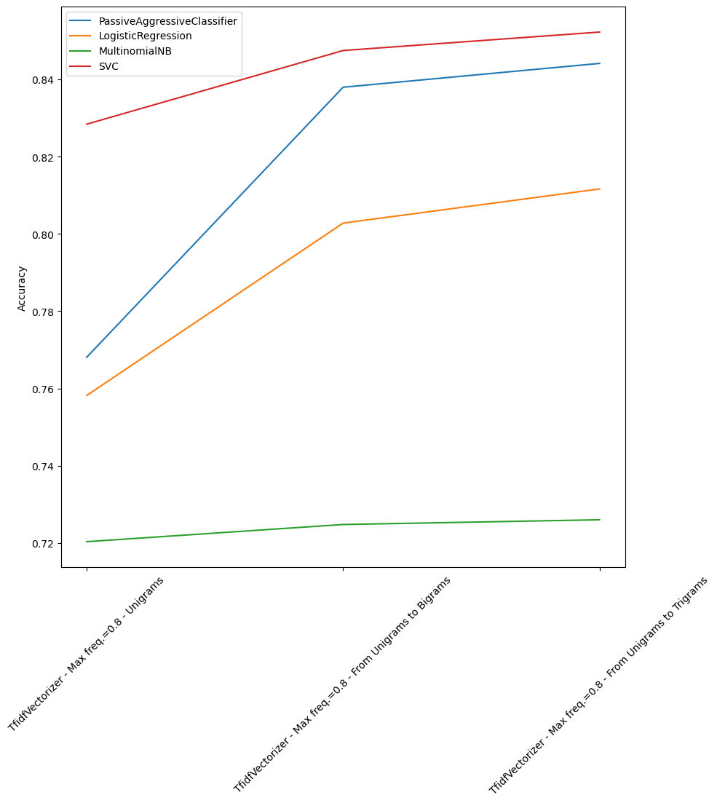

# McDonald's Finder Bot for Telegram 🔥
<table>
<tr>
</tr>
<tr>
<td>
This is a Python-based Telegram bot that allows users to find McDonald's restaurants based on their location and specified preferences. The bot utilizes various features, including distance calculation, ratings, and sentiment analysis, to provide users with accurate and relevant results.
</td>
<td>
 

*[freepik.com](https://www.freepik.com)*
</td>
</tr>
</table>

> ### Disclaimer: 
> Please note that this project is developed as a university project and is intended for educational purposes only. It does not have any commercial intentions or affiliations with McDonald's or any other organizations mentioned.

- [McDonald's Finder Bot for Telegram 🔥](#mcdonalds-finder-bot-for-telegram-)
  - [Features](#features)
  - [Getting Started](#getting-started)
  - [Usage](#usage)
  - [Implementation](#implementation)
    - [Preprocessing 🧹](#preprocessing-)
    - [Analysis based on the number of stars ⭐](#analysis-based-on-the-number-of-stars-)
    - [Analysis based on the sentiment 💫](#analysis-based-on-the-sentiment-)
      - [Homemade classifier](#homemade-classifier)
      - [Library classifier](#library-classifier)
  - [Contributing](#contributing)
  - [License](#license)

## Features

- **Location-based search**: users can specify their current location or any location of interest to find nearby McDonald's restaurants.
- **Distance filtering**: users can set a maximum distance within which the bot will search for McDonald's restaurants.
- **Rating-based recommendation**: the bot provides the first McDonald's restaurant based on ratings, considering it as the primary recommendation.
- **Sentiment-based recommendation**: the bot provides the the best restaurant based on the analysis of the sentiment of users who have already visited it and left a review.
- **Interactive user interface**: the bot offers a user-friendly interface with step-by-step instructions for smooth interaction.

## Getting Started

1. Clone the repository:

```
git clone https://github.com/tkachenko0/McDonalds-FinderBot-for-Telegram
```

2. Install the required dependencies:

```
pip install python-telegram-bot --upgrade
pip install scikit-learn
pip install nltk
pip install matplotlib
```

3. Run the bot:

```
python bot.py
```

## Usage

1. Start the bot by searching for it on Telegram ([@DonMCbot](https://t.me/DonMCbot)) and clicking the "Start" button.

2. Chose if you want to find a the best rated McDonald's restaurant or the one with the best sentiment (or both).

3. Enter your location or share your current location with the bot.

4. Specify the maximum distance to search for McDonald's restaurants.

Then the bot will provide the requested recommendation based on ratings or on sentiment analysis.

<div style="display: flex; justify-content: space-between;">
  
  
  
  
  
</div>


## Implementation

The organization of the project is as follows:

    .
    ├── custom_libs                  # Our custom libraries                   
    │   ├── best_restaurants.py      # Selection of the best place (stars or sentiment)
    │   ├── classification.py        # For testing the classifiers
    │   ├── db.py                    # Database management
    │   ├── dump.py                  # Dump of the models and vectorizers
    │   ├── plotting.py              # Plotting of the results
    │   ├── preprocessing.py         # Preprocessing of the text
    └── datasets                     # Datasets used for the analysis
    └── dump_models                  # Dump of the models and vectorizers
    └── bot_images                   # Images for for the bot
    └── analysis_images              # Images for the analysis
    └── bot.py                       # Bot implementation
    └── nb_OurCLF.ipynb              # Notebook for building our classifier
    └── nb_Project.ipynb             # Notebook for testing the core functionalities

### Preprocessing 🧹
In the preprocessing phase, we initially group the reviews for each restaurant based on the coordinates present in each review.

Subsequently we dedicate ourselves to cleaning the text by removing html elements, we take only alphabetic characters with a regular expression, we eliminate the stopwords and some words present in most of the reviews and we perform the lemmatization.

### Analysis based on the number of stars ⭐
The dataset contains textual reviews for each restaurant where the user also specifies the rating expressed in number of stars, from 1 to 5.

We can only choose the restaurants that the user can reach after receiving his location and the maximum travel distance. Then, we may choose the best restaurant. The best restaurant is the one with the highest average rating.

### Analysis based on the sentiment 💫
This section employs two alternative techniques for sentiment analysis.

#### Homemade classifier
A classifier is created to extract the sentiment labels from a distinct dataset. The message and the related sentiment are contained in the dataset. This analysis is carried out in the notebook [nb_OurCLF](./nb_OurCLF.ipynb) and the steps are: 
  1. Loading of the dataset of chats 
  2. Preprocessing of text
  3. Splitting in Training set and Test sets
  4. Training and testing of the following classifiers showing also the results:
     - Passive Agressive Classifier
     - Logistic Regression Classifier
     - Multinomial Naive Bayes Classifier
     - Support Vector Classifier
  5. Choosing the best classifier
  6. Saving the model

For each flassifier two types of vectorizers were used: **CountVectorizer** and **TfidfVectorizer**. Each of those was tested in different combinations of `ngram_range`:
- Unigrams
- From unigrams to bigrams
- From unigrams to trigrams

Here some of the results obtained for thise combinations:

<div style="display: flex; justify-content: space-evenly;">
  
  
</div>

Additionally, a word2vec model with skip-gram has been tested with the best classifier found previously. 

#### Library classifier
Utilising the [nltk.sentiment](https://www.nltk.org/howto/sentiment.html) library to do sentiment analysis on the [McDonald's Store Reviews dataset](https://www.kaggle.com/datasets/nelgiriyewithana/mcdonalds-store-reviews).

The sentiment analysis is carried out in the [nb_Project](./nb_Project.ipynb) using "SentimentIntensityAnalyser()" and our classifier. The best classifier is then determined by comparing the results of these two analyses. The filtering to choose the best restaurant based on sentiment is then done. 

The choice of the best restaurant is made on the basis of a **score**. The objective of this score is not to overlook information on how many neutral and negative reviews there are as well as positive ones. The logic is to go and assign weights to the different categories with the following formula:

$$\frac{{(NumTotalPositive \times 1) + (NumTotalNeutral \times 0) + (NumTotalNegative \times (-2))}}{{NumTotalReviews}}$$


## Contributing
Contributions are welcome! If you have any ideas, suggestions, or improvements, please submit a pull request. Make sure to follow the existing code style and include appropriate tests.

One significant contribution to the project would be extending the database to include McDonald's restaurants from countries other than the United States. Currently, the bot focuses on providing recommendations based on the available data within the USA from [McDonald's Store Reviews dataset](https://www.kaggle.com/datasets/nelgiriyewithana/mcdonalds-store-reviews).

## License

This project is licensed under the [MIT License](LICENSE).
