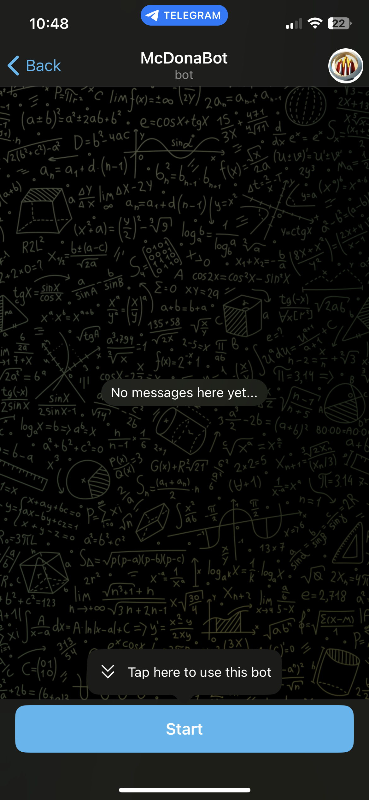
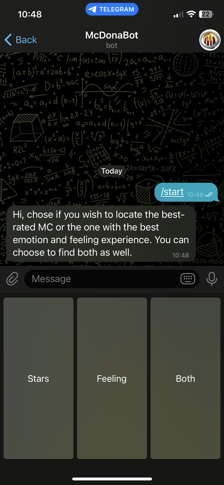
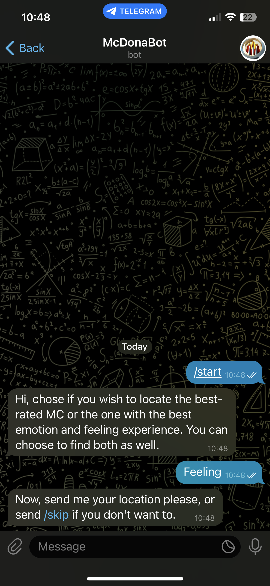
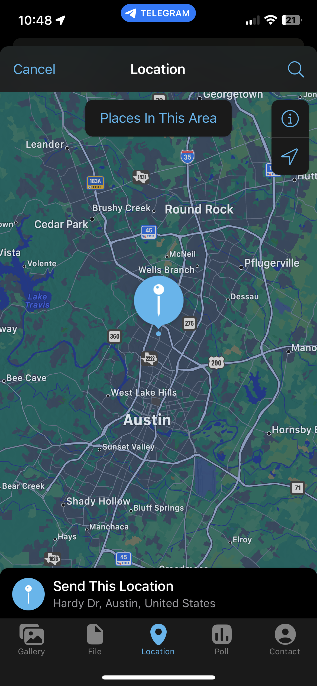
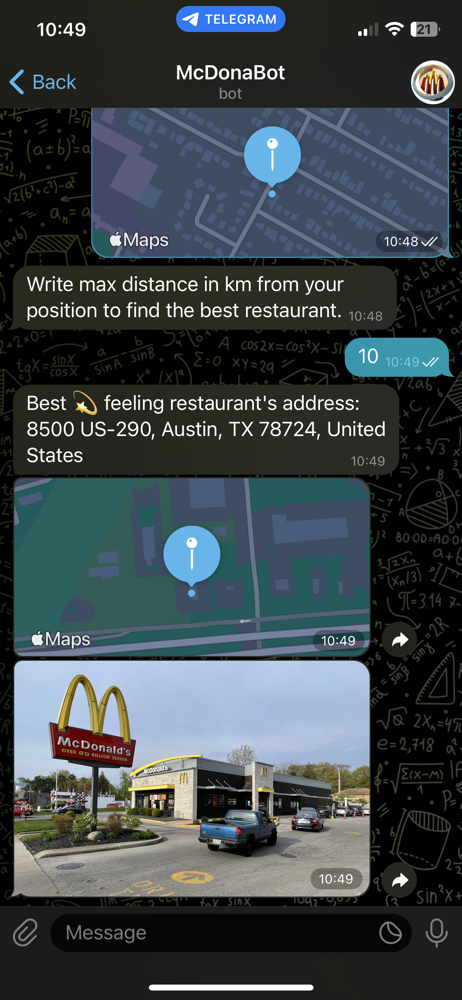

#  McDonald's Finder Bot for Telegram 🔥
*logo generated with [freepik.com](https://www.freepik.com)*

This is a Python-based Telegram bot that allows users to find McDonald's restaurants based on their location and specified preferences. The bot utilizes various features, including distance calculation, ratings, and sentiment analysis, to provide users with accurate and relevant results.

> ### Disclaimer: 
> Please note that this project is developed as a university project and is intended for educational purposes only. It does not have any commercial intentions or affiliations with McDonald's or any other organizations mentioned.

  * [Features](#features)
  * [Getting Started](#getting-started)
  * [Usage](#usage)
  * [Implementation](#implementation)
    + [Preprocessing](#preprocessing)
    + [Analysis based on the number of stars](#analysis-based-on-the-number-of-stars)
    + [Analysis based on the sentiment](#analysis-based-on-the-sentiment)
  * [Contributing](#contributing)
  * [License](#license)

## Features

- **Location-based search**: users can specify their current location or any location of interest to find nearby McDonald's restaurants.
- **Distance filtering**: users can set a maximum distance within which the bot will search for McDonald's restaurants.
- **Rating-based recommendation**: the bot provides the first McDonald's restaurant based on ratings, considering it as the primary recommendation.
- **Sentiment-based recommendation**: the bot provides the the best restaurant based on the analysis of the sentiment of users who have already visited it and left a review.
- **Interactive user interface**: the bot offers a user-friendly interface with step-by-step instructions for smooth interaction.

## Getting Started

1. Clone the repository:

```
git clone 
```

1. Install the required dependencies:

```
pip install python-telegram-bot --upgrade
pip install scikit-learn
pip install nltk
pip install matplotlib
```

1. Run the bot:

```
python bot.py
```

## Usage

1. Start the bot by searching for it on Telegram ([@DonMCbot](https://t.me/DonMCbot)) and clicking the "Start" button.

2. Chose if you want to find a the bestrated McDonald's restaurant or the one with the best sentiment (or both).

3. Enter your location or share your current location with the bot.

4. Specify the maximum distance to search for McDonald's restaurants.

Then the bot will provide the requested recommendation based on ratings or on sentiment analysis.








## Implementation

### Preprocessing

### Analysis based on the number of stars

### Analysis based on the sentiment

## Contributing

Contributions are welcome! If you have any ideas, suggestions, or improvements, please submit a pull request. Make sure to follow the existing code style and include appropriate tests.

One significant contribution to the project would be extending the database to include McDonald's restaurants from countries other than the United States. Currently, the bot focuses on providing recommendations based on the available data within the USA from [McDonald's Store Reviews dataset](https://www.kaggle.com/datasets/nelgiriyewithana/mcdonalds-store-reviews).

## License

This project is licensed under the [MIT License](LICENSE).

## Presentazione

- Definire il problema
- MetStelline
  - risultato bot
- Preprocessing
- MetSia
- MetNostroCLF (capire cosa fa la funzione most_informative_feature_for_class())
    - Tutti i classificatori che abbiamo usato e quello migliore sulla base del acc, ...
- Risultato bot per la classificazione
- Applichiamo i due al dataset del mcdonalds e vediamo (nelle differenze) quale (secondo noi) sia il migliore
- Risultati Finali