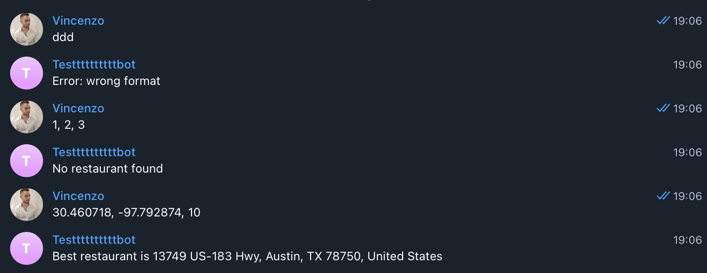

# NLP-Project

## Main

- 💀 Capire quale sia il miglior classificatore da usare (nella presentazione mettiamo tutti i test che abbiamo fatto)

- Provare quella libreria che ha detto lui

- Replicare l'esperimento del tipo che non riesce a raggiungere una accuratezza alta classificando le recensioni in base al numero di stelline 

- a questo punto possiamo fornire n risposte al cliente: quella sulle steelline, quella sul feeling appplicato al dataset, quello sul feeling dal classificatore addestrato su un'altro dataset

## Meno Importante

- Preprocessing
    - Verificare se si può migliorare ancora
    - Cominciare a guardare cosa di questo si può mettere nella presentazione, quali esempi fare

- Capire cosa fa la funzione most_informative_feature_for_class(), potrebbe essere utile per presentare le features più importanti al orale


## Cose 

```bash
$ pip install python-telegram-bot --upgrade
$ python3 bot.py
```

